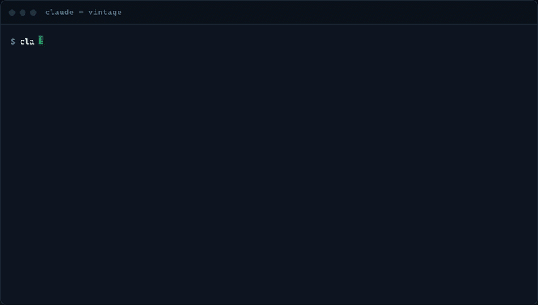

<p align="center">
  
</p>

<p align="center">
  <b>The schema for the free financial data of the web.</b><br>
  <sub>A research terminal that costs $0 and won't lie to you about your Sharpe.</sub>
</p>

<p align="center">
  <a href="https://pypi.org/project/vintage-mcp/"></a>
  <a href="https://github.com/RezaSoleymanifar/vintage/actions/workflows/ci.yml"></a>
  <a href="LICENSE"></a>
  
</p>

<p align="center">
  
</p>

<p align="center">
  <a href="https://rezasoleymanifar.github.io/vintage/"></a>
</p>

<p align="center">
  <a href="https://rezasoleymanifar.github.io/vintage/"><b>rezasoleymanifar.github.io/vintage</b></a>
  &nbsp;·&nbsp;
  &nbsp;·&nbsp;
  <a href="https://rezasoleymanifar.github.io/vintage/reel.html">the reel</a>
</p>

---

### Data filed with, published by, and computed at

| | |
|---|---|
| **U.S. Securities & Exchange Commission** | EDGAR, the filings themselves, with accession numbers and acceptance timestamps |
| **Federal Reserve Bank of St. Louis** | FRED & ALFRED, 800,000+ series, with first-release vintages |
| **Dartmouth College** | Ken French Data Library, the Fama-French factors, from July 1926 |
| **Open Source Asset Pricing** | Chen & Zimmermann, 331 published anomalies with the return and t-stat each paper claimed |

Official filings and central-bank releases, pulled live from the institutions that publish them. Not a scrape, not a CSV dump, not a mirror of someone else's mirror.

---

Free financial data exists and is scattered across twenty APIs with twenty shapes. Everyone rebuilds the same glue, badly, and quietly ends up backtesting on restated figures and survivor-only universes.

Vintage is that glue, written once, served over [MCP](https://modelcontextprotocol.io). It hosts no data. It connects, normalizes, and preserves vintage.

### The schema

The free financial web has no schema. SEC EDGAR calls its dates `end` and `filed`, FRED puts the vintage in a third field called `realtime_start`, the Ken French library ships fixed-width columns with no header and no units, and Coinbase returns an unnamed array ordered by convention. Nothing joins to anything.

Vintage is a schema for it. Every source, every field, every row normalizes to the same nine keys:

| Key | Is |
|---|---|
| `entity` | one key, resolved from a ticker, a CIK or a name |
| `field` | `prefix:name`, the same grammar across all eighteen sources |
| `observed_at` | the date the value describes |
| `known_at` | the date it first became public |
| `value` | the number |
| `unit` | USD, percent, index level, ratio |
| `source` | which publisher it came from |
| `source_url` | the exact endpoint it was read from |
| `vintage` | `as-filed`, or `UNKNOWN_VINTAGE` when no honest date exists |

```json
{"entity": "CIK0000320193", "field": "us-gaap:Assets",
 "observed_at": "2019-09-28", "known_at": "2019-10-31",
 "value": 338516000000, "unit": "USD",
 "source": "sec-edgar-xbrl", "vintage": "as-filed"}
```

Apple's balance sheet closed on 28 September 2019 and nobody could see it until 31 October. Both dates are on the row, so a backtest cannot accidentally use the first one. That is the whole idea, and it is why a new source adds a prefix rather than a tool.

### And a backtester, on top of it

Terminal is not a figure of speech here. The same six verbs run a cross-sectional backtest over the panel the federation just built, with no setup past the install line and no data to download first. What comes back is not only a Sharpe:

| In the code | From |
|---|---|
| Point-in-time panel indexed on `known_at` | structural, there is no flag that disables it |
| Costs charged on turnover | there is no zero-cost mode |
| Deflated Sharpe Ratio | [Bailey & López de Prado (2014)](https://papers.ssrn.com/sol3/papers.cfm?abstract_id=2460551) |
| Session trial ledger feeding that deflation | the same paper, applied to your session |

Named and not yet built: PBO via CSCV, purged k-fold with embargo, minimum backtest length, Newey-West, square-root impact. The full list with citations and status is [below](#the-method), and the `backtest` response says which is which at runtime rather than in a footnote.

## What people use it for

<p align="center">
  <a href="https://rezasoleymanifar.github.io/vintage/"></a>
</p>

<p align="center"><sub>Two of four scenes. <a href="https://rezasoleymanifar.github.io/vintage/">see the full reel on the site</a>.</sub></p>

## Install

One line. Nothing to clone.

**Claude Code**

```bash
claude mcp add vintage -s user -- uvx vintage-mcp
```

**Claude Desktop / any MCP client.** Add to your config file:

```json
{
  "mcpServers": {
    "vintage": {
      "command": "uvx",
      "args": ["vintage-mcp"]
    }
  }
}
```

<sub>Claude Desktop config lives at `%APPDATA%\Claude\claude_desktop_config.json` (Windows) or `~/Library/Application Support/Claude/claude_desktop_config.json` (macOS). Restart the app afterwards. MCP servers load once at startup.</sub>

Needs [`uv`](https://docs.astral.sh/uv/getting-started/installation/). If you'd rather use pip: `pip install vintage-mcp` and set the command to `vintage`.

### Optional configuration

Everything works with zero configuration. These make it work better:

| Variable | Why |
|---|---|
| `VINTAGE_USER_AGENT` | SEC EDGAR asks for a real contact. `"Your Name your@email.com"`. |
| `FRED_API_KEY` | [Free key](https://fredaccount.stlouisfed.org/apikeys), unlocks 800k macro series with first-release vintages. |
| `VINTAGE_CACHE_DIR` | Defaults to `~/.cache/vintage`. |

Set them under `"env"` in the same config block:

```json
{
  "mcpServers": {
    "vintage": {
      "command": "uvx",
      "args": ["vintage-mcp"],
      "env": {
        "VINTAGE_USER_AGENT": "Jane Quant jane@example.com",
        "FRED_API_KEY": "..."
      }
    }
  }
}
```

Your key stays in this file. It is read by the server process and is never passed through the model or written into the conversation.

## Use it as a library

The same data, without the server. Everything is synchronous and returns pandas,
including inside Jupyter where a loop is already running.

```python
import vintage as v

# prices and the cross-section
v.prices("AAPL", start="2020-01-01")          # daily prices, with known_at
v.panel(["AAPL", "MSFT", "JNJ"])              # dates x tickers
v.returns(v.panel(["AAPL", "MSFT"]))          # so a notebook needn't reinvent it
v.corporate_actions("AAPL")                   # every split and dividend, dated
v.index("^GSPC"); v.crypto("BTC-USD")

# filings
v.fundamentals("AAPL", "us-gaap:Assets", as_of="2020-01-01")
v.restatements("AAPL", "us-gaap:Assets")      # periods reported twice, differently
v.filings("AAPL")                             # timeline, with acceptance timestamps
v.cross_section("Assets", "CY2023Q1I")        # one concept, every filer, one call
v.delistings(as_of="2010-01-01")              # Form 25: what a 2010 universe is missing
v.survivorship_warning("2010-01-01")          # and how badly that flatters a backtest

# macro, rates, factors, claims
v.factors("ff3")                              # Ken French, wide
v.macro("DGS10", as_of="2008-09-15")          # ALFRED first-release vintage
v.treasury_yields("10y"); v.fx("EURUSD"); v.volatility("VIX")
v.positioning("SP500")                        # CFTC Commitments of Traders
v.claim("Mom12m")                             # what the paper claimed
v.claims(price_only=True)                     # the 56 replicable with free data

# crowd and flow
v.short_volume("AAPL")                        # FINRA daily short volume
v.sentiment("wallstreetbets")

# discovery, and the engine
v.search("inflation expectations"); v.sources(); v.signals()
v.backtest(["AAPL", "MSFT", "JNJ"], "momentum_12_1")
v.trials()                                    # specs scored this session
```

`known_at` is kept as a column on every frame rather than dropped for tidiness.
Losing it is how a point-in-time dataset quietly becomes an ordinary one. Pass
`as_of` and rows published after that date are gone before you see them.

## Try it

Once installed, ask your assistant:

> *"What was Apple's total assets as of January 2020, and has it been restated since?"*
>
> *"Backtest 12-1 momentum on the Dow 30 since 2010."*
>
> *"Now try short-term reversal instead. Did the alpha survive?"*

The third question is the one that matters. Watch the deflated Sharpe fall as you keep asking.

## The two dates

Every value carries both:

- `observed_at`, what period the number describes
- `known_at`, when it first became public

A backtest may only use rows whose `known_at` precedes the trade date. That is structural, not a setting: the panel is indexed on `known_at`, so any slice of it is automatically point-in-time. There is no flag to turn it off.

Sources that cannot supply an honest `known_at` are flagged `UNKNOWN_VINTAGE` rather than given a fabricated date.

### Six ways yesterday's data quietly changed

- **Lag**. The number is true in December, published in February.
- **Restatement**. The company says "oops, wrong" and changes last year's figure.
- **Revision**. The government keeps fixing old jobs and inflation numbers, for years.
- **Survivorship**. Dead companies get deleted; only the winners are still listed.
- **Membership**. Today's S&P 500 list is not the list from 2005.
- **Price adjustment**. Splits and dividends silently rewrite every price before them.

All six say the same thing: the data you have today is not what people saw back then.

## Six verbs

Source is a parameter, never a separate tool. Twenty more sources adds zero tools.

| Verb | Does |
|---|---|
| `resolve` | Any identifier → the entity key everything else accepts |
| `discover` | Plain-English search across every source's catalog |
| `fetch` | The workhorse. Any field, any source, with `as_of` |
| `events` | Filing timeline with exact public timestamps |
| `backtest` | Cross-sectional signal → returns, costs, honesty report |
| `benchmark` | Your returns → correlation and alpha vs published factors |

Plus `capabilities`, which lists the surface in one call, and `status` for cache size,
keys, and how many specs you have tried.

## The honesty engine

A conversational backtester is an overfitting machine unless it counts how many times you asked. Every backtest returns:

- **Deflated Sharpe** ([Bailey & López de Prado, 2014](https://papers.ssrn.com/sol3/papers.cfm?abstract_id=2460551)) accounting for every spec tried this session
- **The Sharpe noise would have produced** given that trial count
- **First-half vs second-half Sharpe**
- Costs always charged on turnover. There is no zero-cost mode
- A standing survivorship warning, because the universe is a list of names that exist today
- Any ticker dropped for want of price history, named rather than silently skipped

This is the part a paid terminal does not do for you.

## The method

Vintage implements the backtest-validation literature rather than inventing its own statistics. Execution realism is a different problem, already solved by [LEAN](https://www.quantconnect.com/lean) and [Nautilus Trader](https://nautilustrader.io/). Vintage runs before that, at the stage where most ideas should die.

| Technique | Source | Status |
|---|---|---|
| Point-in-time panel indexed on `known_at` | structural, no flag to disable | shipped |
| Costs charged on turnover, always | no zero-cost mode exists | shipped |
| Deflated Sharpe Ratio | [Bailey & López de Prado (2014)](https://papers.ssrn.com/sol3/papers.cfm?abstract_id=2460551) | shipped |
| Session trial ledger feeding the deflation | Bailey & López de Prado (2014) | shipped |
| Probability of Backtest Overfitting, via CSCV | [Bailey, Borwein, López de Prado & Zhu (2017)](https://papers.ssrn.com/sol3/papers.cfm?abstract_id=2326253) | planned |
| Purged k-fold CV with embargo | *Advances in Financial Machine Learning*, ch. 7 | planned |
| Combinatorial purged cross-validation | *Advances in Financial Machine Learning*, ch. 12 | planned |
| Minimum Backtest Length | [Bailey, Borwein, López de Prado & Zhu (2014)](https://www.ams.org/notices/201405/rnoti-p458.pdf) | planned |
| Newey-West adjustment for autocorrelated returns | Newey & West (1987) | planned |
| Square-root market impact | Almgren et al. (2005) | planned |

Citations are references, not endorsements. None of these authors is affiliated with Vintage. Anything marked planned is not in the code yet, and the `backtest` response says so at runtime rather than in the footnotes.

## Where the data comes from

<table>
<tr>
<td align="center"><b>100</b><br><sub>years, July 1926 to this morning</sub></td>
<td align="center"><b>331</b><br><sub>published anomalies, with claims</sub></td>
<td align="center"><b>18</b><br><sub>sources, six verbs</sub></td>
<td align="center"><b>10,398</b><br><sub>ticker-mapped US filers</sub></td>
<td align="center"><b>800k+</b><br><sub>macro series with vintages</sub></td>
</tr>
</table>

**A century of market history, eighteen sources, and sixteen of them need no key at all.** The Fama-French factors start in July 1926 and the SEC filing stream runs to this morning. Vintage covers both ends from the same six verbs.

**Most of these are the primary source.** Not a reseller, not a scraper. The filings come from the regulator that receives them, the macro series from the central bank that publishes them, and the factors from the university that computes them.

| Source | Standing | Covers | Key | Point-in-time |
|---|---|---|---|---|
| **SEC EDGAR XBRL** | Primary · US regulator | Every concept every US filer has tagged, with accession number and filing date on each figure. Restatements arrive as rows, never as an overwrite. | none | yes, native filing dates |
| **SEC filings stream** | Primary · US regulator | 8-K, 10-K, 10-Q, Form 4, 13D/G, timestamped to the second EDGAR accepted them. | none | yes, exact timestamps |
| **FRED / ALFRED** | Primary · central bank | Federal Reserve Bank of St. Louis. ALFRED keeps first releases, so you can ask what CPI looked like *that morning*. | free | yes, first-release vintages |
| **Ken French Data Library** | Primary · academic | Dartmouth. FF3, FF5, momentum, daily FF3, 49 industry portfolios, from where the authors publish them. | none | no, rebuilt each release |
| **Open Source Asset Pricing** | Primary · academic | Chen & Zimmermann. 331 published predictors with claimed return, t-stat, sample window and an implementable definition. `openap:Mom12m` returns Jegadeesh-Titman's 1.31%/mo, t=3.74. | none | yes, claims dated to publication year |
| **SEC Form 13F** | Primary · US regulator | Institutional equity holdings for every manager over $100m. Quarter end and filing date are up to 45 days apart and both are kept, so `as_of` returns the book that was actually public. | none | yes, quarter end vs filing date |
| **SEC Form 25** | Primary · US regulator | Every delisting on record, 36,830 filings across 11,614 companies. The correction for a universe built from names that still exist. | none | yes, filing dates, never revised |
| **SEC XBRL frames** | Primary · US regulator | One concept across every filer in a single call. 6,289 companies in 840 KB. The shape a cross-sectional sort needs. | none | no, carries the accession, not its date |
| **US Treasury** | Primary · US government | The par yield curve, 14 tenors from one month to thirty years, published each business day. | none | yes, never revised |
| **CFTC** | Primary · US regulator | Commitments of Traders. Tuesday's positioning by trader class, released the following Friday, and the lag is preserved. | none | yes, lag preserved in `known_at` |
| **Bureau of Labor Statistics** | Primary · US agency | CPI down to item strata, payrolls, JOLTS, wages, productivity. Any series id, not a curated shortlist. | optional | no, ships no release date |
| **Bureau of Economic Analysis** | Primary · US agency | The national accounts. One call returns every line of a NIPA table rather than one series at a time. | free | no, current estimate only |
| **European Central Bank** | Primary · central bank | Daily FX reference rates since 1999, plus any cross derived from two euro legs and labelled as derived. | none | yes, published once, never revised |
| **CBOE** | Primary · exchange | VIX and the whole volatility family (term structure, VVIX, SKEW) back to 1990. | none | yes, index levels are not revised |
| **FINRA** | Primary · US regulator | Daily short sale volume per symbol, published after each close and never revised. Short *volume*, not short interest. | none | yes, never revised |
| **Coinbase Exchange** | Exchange | Crypto OHLCV, every listed pair. | none | yes, trade prints are never restated |
| **ApeWisdom** | Community | Forum mention ranks across ~15 subreddits. No history upstream, rows are stamped when Vintage fetched them. | none | forward only, from the day you record it |
| **Yahoo Finance** | Third party | Daily OHLCV and adjusted close, decades deep. | none | partial, adjusted retroactively, flagged on every row |

**[COVERAGE.md](COVERAGE.md) is the full field-by-field catalogue**. Every prefix, every dataset, every signal, with measured coverage spans. It is generated from the registry, so it cannot drift from the code.

Counts current as of August 2026. Vintage redistributes none of this. Each upstream source keeps its own terms.

### On Yahoo Finance

It is the one third-party source here, and the weakest link: an undocumented endpoint with grey terms that can change without notice. It stays because it is the only free source of decades-deep daily prices, and prices are the spine of every backtest. Ken French gives factor returns, not individual securities.

It is mitigated rather than hidden. Vintage fetches per user and redistributes nothing, every price row is flagged as retroactively adjusted, and the price layer is a single adapter, so a keyed alternative (Tiingo, Alpaca) can slot in behind the same `price:` prefix without touching anything else. Stooq was the intended spine (friendlier terms) but it now gates programmatic access behind a JavaScript check. That adapter stays in case the check lifts.

See [`PRINCIPLES.md`](PRINCIPLES.md) for the rules that decide arguments, [`COVERAGE.md`](COVERAGE.md) for what is wired up today, [`DATA_SOURCES.md`](DATA_SOURCES.md) for the wider free-data landscape, [`DATA_ROADMAP.md`](DATA_ROADMAP.md) for what is queued next and the endpoint probes behind each candidate, [`DESIGN.md`](DESIGN.md) for the architecture, and [`INTEGRATIONS.md`](INTEGRATIONS.md) for the engines Vintage should feed next, LEAN and Alpaca, both open for contribution.

## Cache

Gzipped JSON in `~/.cache/vintage`, tiered by how mutable the data is: closed periods never refetch, academic datasets monthly, current fundamentals daily, prices per session. An hour of conversation is roughly 20 upstream calls.

## Known gaps

Stated plainly, because the alternative is shipping a bad substitute:

Data:

- **Survivorship**, the delisting record ships but the backtester does not yet consume it. Form 25 gives you every name that left, dated, and `survivorship_warning()` tells you how many a universe built today is missing. The universe the backtester builds is still current-listing only, and it says so on every run.
- **Analyst estimates**, no free source exists.
- **Historical options chains**, paid everywhere.
- **Point-in-time index membership**, licensed by S&P and MSCI.

Engine. The backtester is vectorized and cross-sectional, which is a rung below an event-driven simulator:

- **No purging or embargo**, overlapping label windows can leak across a train/test split ([López de Prado, AFML](https://www.wiley.com/en-us/Advances+in+Financial+Machine+Learning-p-9781119482086) ch. 7). Deflation catches selection bias, not leakage.
- **No market impact**, costs are a flat charge on turnover, so large-notional results are optimistic.
- **No PBO**, deflated Sharpe covers multiple testing; the Probability of Backtest Overfitting via combinatorially symmetric cross-validation would be the stronger test.
- **Trial count resets each session**, ask forty things today and forty tomorrow, and tomorrow starts from zero.
- **Sharpe is per observation, not annualized**. That is the frequency the deflation is defined at, and the response says so.

## Development

```bash
git clone https://github.com/RezaSoleymanifar/vintage
cd vintage
uv sync --group dev
uv run pytest
```

`smoke_test.py` exercises all six verbs against the live sources, useful before a release, and it needs network.

## License

MIT. Vintage redistributes no data; each upstream source keeps its own terms.

<sub>mcp-name: io.github.RezaSoleymanifar/vintage</sub>
